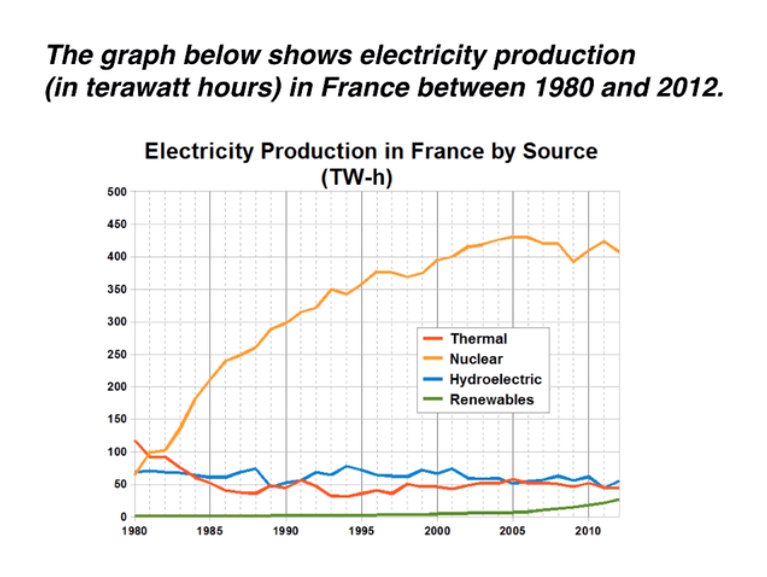

**ESSAY**
***
**The** line graph compares the amount of electricity produced in France using four different sources of power over a period of 32 years.
***
**It** is clear that nuclear power was by far the most important means of electricity generation over the period shown. **Renewables** provided the lowest amount of electricity in each year.
***
**In** 1980, thermal power stations were the main source of electricity in France, generating around 120 terawatt hours of power. **Nuclear** and hydroelectric power stations produced just under 75 terawatt hours of electricity each, and renewables provided a negligible amount. **Just** one year later, newclear power overtook thermal power as the primary source of electricity.
***
**Between** 1980 and 2005, electricity production from nuclear power rose dramatically to a peak of 430 terawatt hours. **By** contrast, the figure for thermal power fell to only 50 terawatt hours in 1985, and remained at this level for the rest of the period. **Hydroeletric** power generation remained relatively stable, at between 50 and 80 terawatt hours, for the whole 32-year period, but renewable electricity production saw only a small rise to approximately 25 terawatt hours by 2012.  