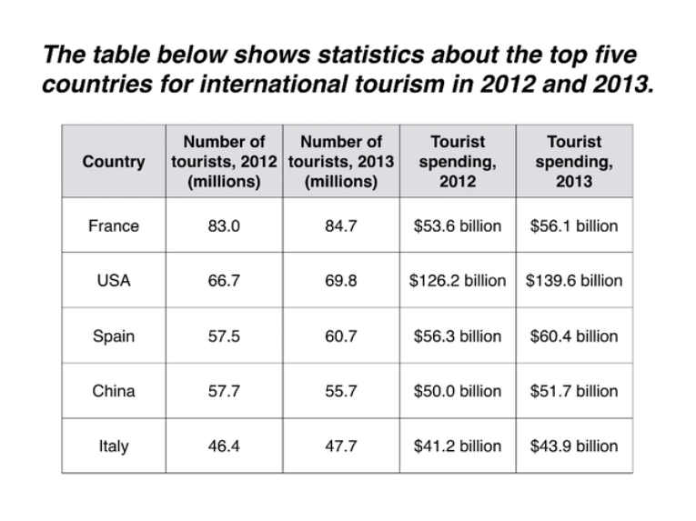

  
**ESSAY**
***
**The** table compares the five highest ranking countries in terms of numbers of visits and the money spent by tourists over a period of two years.
***
**It** is clear that France was the world's most popular tourist destination in the years 2012 and 2013. **However**, the USA earned by far the most revenue from tourism over the same period.
***
**In** 2012, 83 million tourists visited France, and the USA was the second most visited country, with 66.7 million tourists. **Spain** and China each received just under 58 million visitors, while Italy was ranked fifth with 46.4 million tourists. **2013** saw a rise of between 1 and 4 million tourist visits to each country, with the exception of China, which received 2 million fewer visitors than in the previous year.
***
**Spending** by tourists visiting the USA increased from $126.2 billion in 2012 to $139.6 billion in 2013, and these figures were well over twice as high as those for any other country. **Spain** received the second highest amounts of tourist revenue, rising from $56.3 billion to $60.4 billion, followed by France, China and Italy. **Interestingly**, despite falling numbers of tourists, Chinese revenue from tourism fose by $1.7 billion in 2013.  
