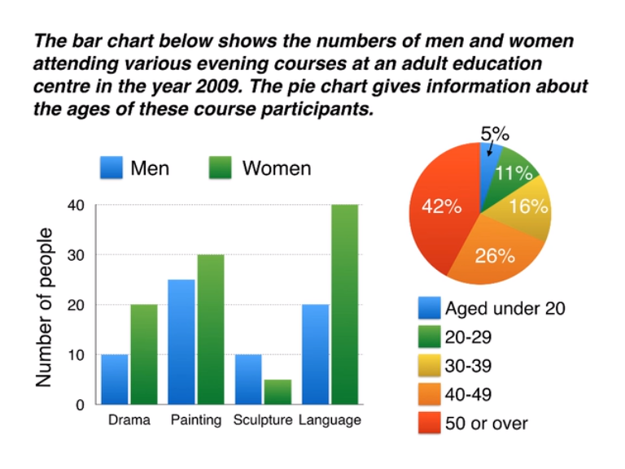

**ESSAY**
***
**The** bar chart compares the numbers of males and females who took four different evening classes in 2009, and the pie chart shows the age profile of these attendees.
***
**It** is clear that significantly more women than men attended evening classes at the education centre. **We** can also see that evening courses were much more popular among older adults.
***
**According** to the bar chart, drama, painting and language courses all attracted more women than men to the education centre in 2009. **Language** classes had the highest number of participants overall, with 40 female and 20 malestudents, while painting was a popular choice among both genders, attracting 30 female and 25 male attendees. **The** only course with a higher number of males was sculpture, but this course was taken by a mere 15 people in total.
***
**Looking** at the age profile pie chart, we can see taht the majority of people attending evening lessons were over 40 years of age. **To** be precise, 42% of them were aged 50 or more, and 26% were aged between 40 and 49. **Yong** adults were in the minority, with only 11%of students aged 20 to 29, and only 5% aged under 20.