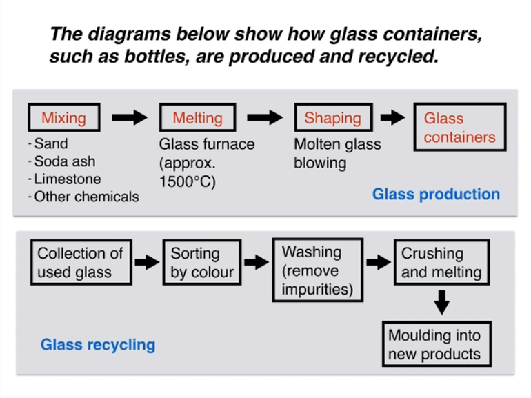

  
**ESSAY**
***
**The** first flow diagram illustrates the process of glass container production, and the second diagram shows steps in the process of recycling used glass.
***
**We** can see that glass is made using three main raw materials, and that the manufacturing process consists of four distinct stages. **It** requires five steps to turn used glass into new glass products.
***
**At** the first stage in the production of glass, sand, soda ash, limestone and other chemicals are mixed together. **Next**, this mixture is heated in a glass furnace at approximately 1500℃ to produce molten glass. **The** molten glass can then be shaped, by blowing, to create the end products, namely glass containers.
***
**Glass** recycling begins with che collection of used glass products. **The** collected glass is sorted according to its colour, and then washed in order to remove any impurities. **At** the fourth stage of recycling, the glass is crushed and melted, and the resulting molten glass can finally be moulded to create new items.